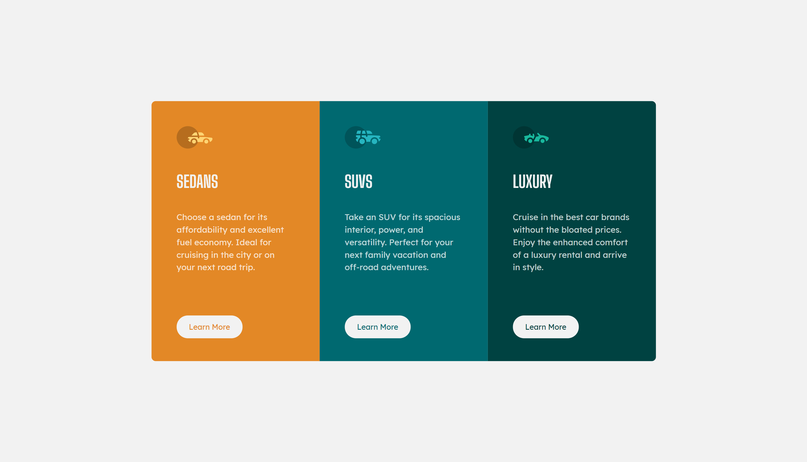

# Frontend Mentor - 3-column preview card component solution

This is a solution to the [3-column preview card component challenge on Frontend Mentor](https://www.frontendmentor.io/challenges/3column-preview-card-component-pH92eAR2-). Frontend Mentor challenges help you improve your coding skills by building realistic projects. 

## Table of contents

- [Overview](#overview)
  - [The challenge](#the-challenge)
  - [Screenshot](#screenshot)
  - [Links](#links)
- [Built with](#built-with)
- [Author](#author)

## Overview

### The challenge

Users should be able to:

- View the optimal layout depending on their device's screen size
- See hover states for interactive elements

### Screenshot

### Links

- Solution URL: [www.frontendmentor.io/solutions/3-column-cards-with-scss-LG2a5GSed](https://www.frontendmentor.io/solutions/3-column-cards-with-scss-LG2a5GSed)
- Live Site URL: [flash54.github.io/3ColumnCards/](https://flash54.github.io/3ColumnCards/)

## Built with

- Semantic HTML5 markup
- SCSS
- Flexbox
- Favicons (for icons)

## Author

- Website - [flash54.github.io](https://flash54.github.io/)
- Frontend Mentor - [@flash54](https://www.frontendmentor.io/flash54/)
